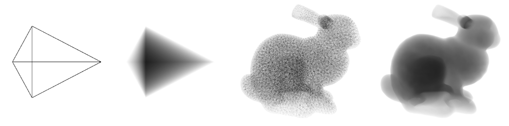

# Interval Shading: using Mesh Shaders to generate shading intervals for volume rendering

This repository contains the source code for the article "Interval Shading: using Mesh Shaders to generate shading intervals for volume rendering" available at https://hal.science/hal-04561269

## Dependencies

This project can be run on Windows 10 (or newer) and on Ubuntu 22 (or newer), your GPU need to be mesh shader compatible (RTX 20770 or newer for NVidia)
To compile this project you need to have the following depencies installed :
  - a C++20 compiler
  - CMake
  - Vulkan SDK (1.3.239 or newer)
  - GLFW3 (For Ubuntu users only, it comes as a submodule for Windows)
  - libglfw3-dev libxinerama-dev libxcursor-dev libxi-dev (for Ubuntu users only)

On Ubuntu 24 you can run the setup.sh file to install all dependencies

## Getting Started 

Make sure all the submodules have been pulled with the following command:

```
git submodule update --init --recursive
```

## Compiling

first use cmake to configure the project:
```
cmake -S . -B build
```

Then go to the build folder with:
```
cd build
```

and compile with :
```
make
```

## Testing

The Six examples:
  - armadillo -> Figure 5
  - asteroids -> Figure 9
  - bunny -> Figure 1
  - crystal -> Figure 7
  - jet -> Figure 8
  - singleTet -> Figure 6

can be run by using
```
./[nameOfTheExample]
```

In all the examples, the mouse can be used to move around the objects and the keyboard's arrow can be used to move the camera.
In the jet example, the 'o' key start the animation and the 'p' key pauses it. 

## Citing 

@article{tricard:hal-04561269,
  TITLE = {{Interval Shading: using Mesh Shaders to generate shading intervals for volume rendering}},
  AUTHOR = {Tricard, Thibault},
  URL = {https://hal.science/hal-04561269},
  JOURNAL = {{Proceedings of the ACM on Computer Graphics and Interactive Techniques}},
  PUBLISHER = {{ACM}},
  VOLUME = {7},
  NUMBER = {3},
  PAGES = {1-11},
  YEAR = {2024},
  MONTH = Apr,
  DOI = {10.1145/3675380},
  KEYWORDS = {Mesh Shading ; Rendering ; Rasterization},
  PDF = {https://hal.science/hal-04561269v3/file/Interval_Shader_HPG2024-2.pdf},
  HAL_ID = {hal-04561269},
  HAL_VERSION = {v3},
}

